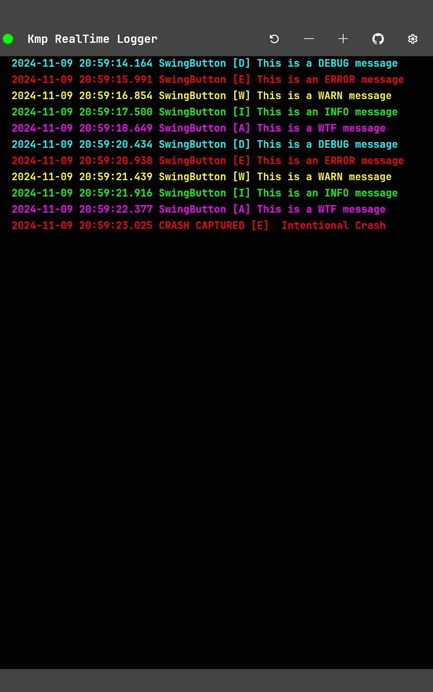
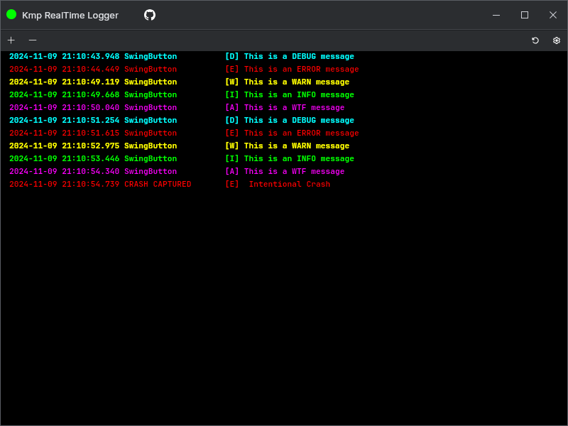

# KMP RealTime Logger

KMP RealTime Logger is a Kotlin Multiplatform logging library that replicates the functionality of Android's Log library for use in common code across all platforms (Native, JVM, JS, WASM, and Android).

## Features

- Supports all major platforms: Native, JVM, JS, WASM, and Android
- Mimics the Android Log API for familiar usage
- Configurable log levels
- Platform-specific implementations
- Available on Maven Central
- Throwable support in `Log.e()` for detailed error logging including stack traces
- Development mode setting for controlling logging in production vs development phases
- Live log broadcasting to another device on the same local network

## Installation

Add the following dependency to your `build.gradle.kts` file:

```kotlin
implementation("io.github.kdroidfilter:kmplog:0.6.0")
```

KMPLog is available on Maven Central, ensuring easy integration into your projects.

## Usage

### Basic Logging

```kotlin
import com.kdroid.kmplog.Log

Log.d("MyTag", "This is a debug message")
Log.i("MyTag", "This is an info message")
Log.e("MyTag", "This is an error message")
Log.e("MyTag", "This is an error message with exception", throwable)
```

### Setting Log Level

```kotlin
Log.setLogLevel(Log.INFO)
```

### Setting Development Mode

```kotlin
Log.setDevelopmentMode(true)
```

Logs will only be displayed when development mode is enabled, providing better control over logging during production and development phases.

### Enabling Broadcasting Mode

KMPLog allows you to broadcast logs live to another device on the same local network. This can be useful for real-time log monitoring during development or debugging sessions.

To enable broadcasting mode, use the following function:

```kotlin
Log.enableBroadcastingMode(ip: String? = null, port: Int = DEFAULT_SERVICE_PORT)
```

- `ip`: Optional. Specify the IP address of the client device to receive the logs. If not provided, the library will automatically discover and connect to the client device using mDNS (Multicast DNS) services.
- `port`: Optional. Specify the port to use for broadcasting. By default, it uses the `DEFAULT_SERVICE_PORT`.

Example:

```kotlin
Log.enableBroadcastingMode("192.168.1.10", 8080)
```

This will broadcast logs to the device with IP `192.168.1.10` on port `8080`.

### Checking if a Log Level is Loggable

```kotlin
if (Log.isLoggable("MyTag", Log.DEBUG)) {
    // Perform debug logging
}
```

## Client Application

<p align="center">
    
</p>

To facilitate real-time log monitoring, we have also developed a client application that listens to the logs broadcasted over the local network.

The client application uses mDNS to discover broadcasting devices automatically and display the logs in real-time. Note that automatic detection using mDNS only works from an Android or JVM application.

### Features of the Client Application

- Automatic discovery of broadcasting devices using mDNS
- Real-time log display with filters for different log levels (DEBUG, INFO, WARN, ERROR)
- Easy setup with minimal configuration required

### Screenshots

Below are some screenshots demonstrating the functionality of the client application:

- **Real-Time Log Monitoring**

<p align="center">
    
</p>

<p align="center">
  
</p>

### Installation and Setup

The client application is available for installation on various platforms. Please refer to the [client app documentation](path/to/client_app_documentation) for more details on installation and usage.

## API Reference

- `Log.v(tag: String, msg: String)`: Log a VERBOSE message
- `Log.d(tag: String, msg: String)`: Log a DEBUG message
- `Log.i(tag: String, msg: String)`: Log an INFO message
- `Log.w(tag: String, msg: String)`: Log a WARN message
- `Log.e(tag: String, msg: String, throwable: Throwable?)`: Log an ERROR message, optionally with a throwable for detailed error logging
- `Log.wtf(tag: String, msg: String)`: Log a WTF (What a Terrible Failure) message
- `Log.println(priority: Int, tag: String, msg: String)`: Log a message with custom priority
- `Log.setDevelopmentMode(isDevelopment: Boolean)`: Enable or disable development mode
- `Log.setLogLevel(level: Int)`: Set the log level
- `Log.enableBroadcastingMode(ip: String? = null, port: Int = DEFAULT_SERVICE_PORT)`: Enable broadcasting mode to stream logs to another device on the local network

## Contributing

Contributions are welcome! Please feel free to submit a Pull Request.

## License

KMPLog is released under the MIT License. See the [LICENSE](LICENSE) file for details.

